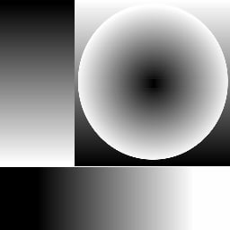
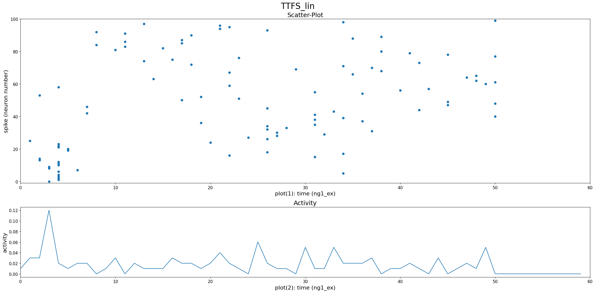
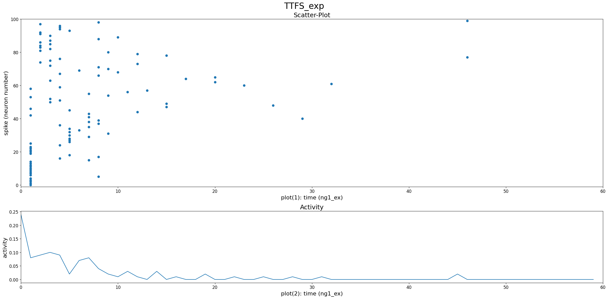
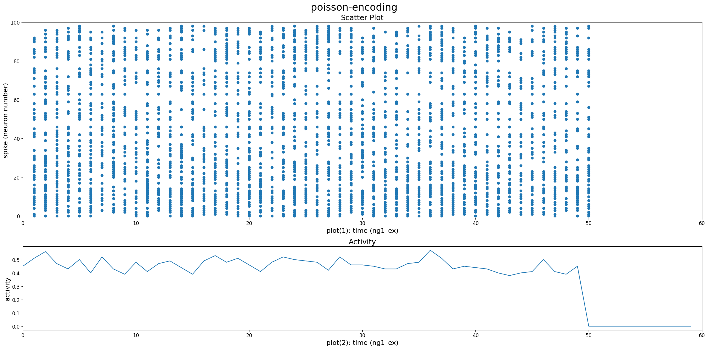
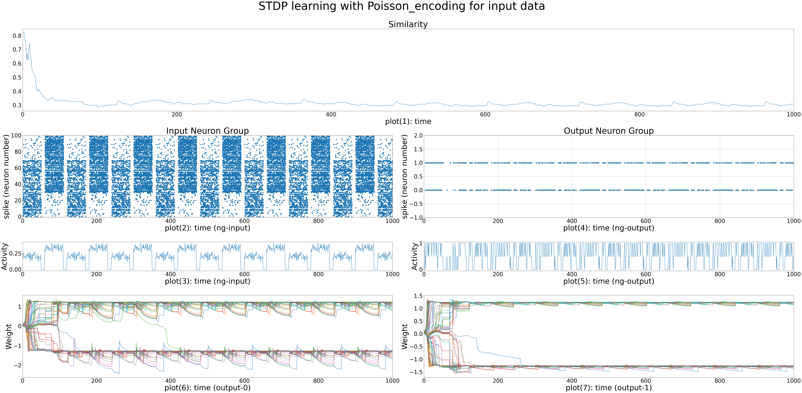
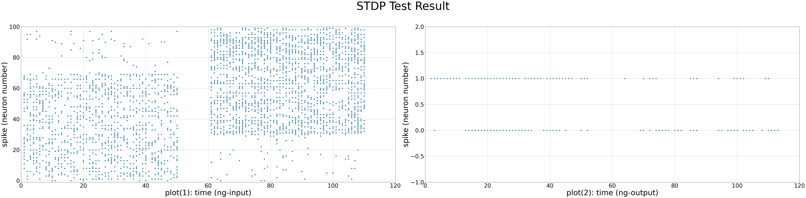
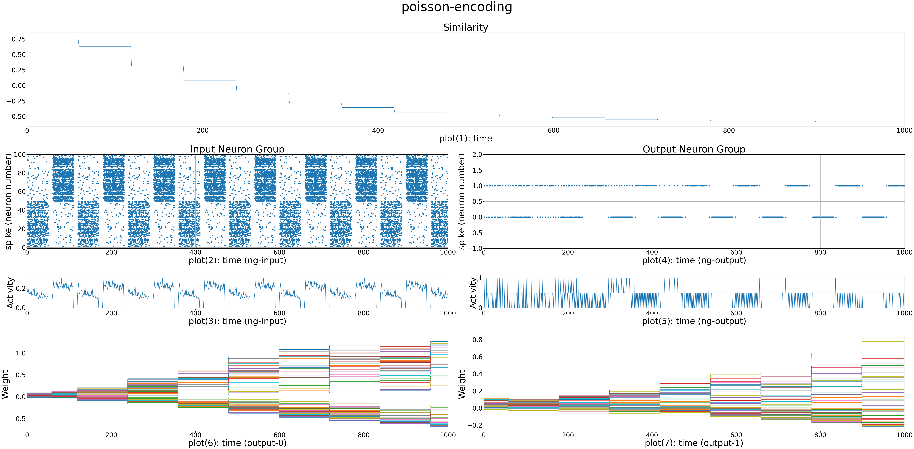
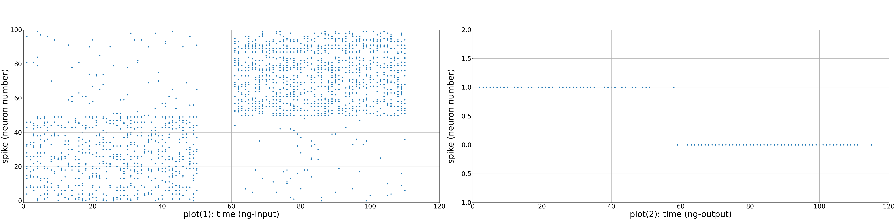
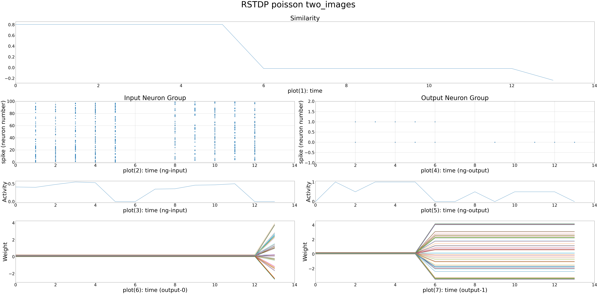
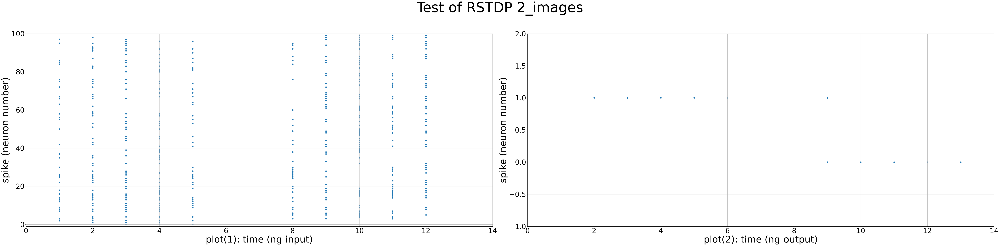

# Neural Encoding and Learning Dynamics: Implementing Encoding Techniques and Learning Rules in Neural Networks

## Introduction

In this project, we explore various methods of information encoding, unsupervised learning, and reinforcement learning processes. Our goal is to gain insights into the learning mechanisms based on Hebb's rule and to develop an understanding of different neural encoding strategies. The project also includes the implementation and analysis of learning rules within a spiking neural network model.

## The data is used through this project

### Images

image 1:

image2:

## Project Objectives

1. **Understanding Encoding Methods**: We aim to explore various information encoding methods and how to convert input stimuli into spikes.

2. **Familiarity with Unsupervised and Reinforcement Learning**: We seek insights into the processes and applications of unsupervised learning and reinforcement learning techniques.

3. **Comprehension of Hebbian Learning**: Our objective is to understand the principles of learning according to Hebb's rule and its implications in neural network models.

## Activities

### 1. Implementing Different Encoding Methods

We implement the following encoding techniques:

- **Time to First Spike Encoding**: Encoding based on the timing of the first spike.
  - Linear approach: 
  - Exponential approach: 

- **Numerical Value Encoding**: Conversion of numerical values into spike patterns.
  - Encoding 1 in range of (0,10).png)
  - Encoding 4.7 in range of (0,10).png)
  - Encoding 5.1 in range of (0,10).png)
  - Encoding 51 in range of (0,10).png)

- **Poisson Distribution Encoding**: Using Poisson distribution for spike timing.
  - Encoded image using Poisson encoding method:

### Task

Assume that input stimuli are present for a duration of T milliseconds. We apply the three encoding methods to these stimuli and analyze the results. We represent the generated spikes as a raster plot and interpret the different encoding methods' results.

### 2. Implementing Unsupervised Learning

We develop an unsupervised learning rule such as STDP (Spike-Timing-Dependent Plasticity) or its simplified version, FlatSTDP:

- **Spiking Neural Network Design**: Creation of a spiking neural network with an input and an output layer, ensuring all input neurons connect to all output neurons.

- **Poisson Distribution for Input Neurons**: Consideration of two different activity levels (e.g., blue and yellow) in the upper chart for input neuron activity using Poisson distribution.

### Task

We randomly activate either of the two input activity levels and allow the output neurons to learn using the implemented learning rule. We track the synaptic weight changes for the two output neurons during the training process and visualize them.

- **Analysis**:
  - We determine if the output neurons have learned the different input levels and explain why.
  - We add one neuron to each of the input and output layers that does not fire spikes during training and analyze the changes in weights connected to these neurons.
  - We implement minimal activity for neurons in both layers and compare weight changes to the previous state.

We repeat the experiment for different parameter values, report the results, and analyze the learning process and the impact of parameter variations.

- Train:
- Test:
  - learning policy is the number of sparks in the input time for each input.

### 3. Implement Reinforcement Learning

We develop a reinforcement learning rule such as RSTDP (Reward-modulated Spike-Timing-Dependent Plasticity) or its simplified version, FlatRSTDP.

### Task

We repeat the experiments from the previous activity using this learning rule. We place the obtained results side by side and analyze the learning process and the influence of parameters.
| **Parameter**              | **Value**              | **Parameter**                | **Value**                  |
|----------------------------|------------------------|------------------------------|----------------------------|
| $input\_current$           | $constant\_current-0$  | $output\_current$            | $constant\_current-0$      |
| $input\_model$             | $LIF$                  | $output\_model$              | $LIF(tau\_m=3|R=10)$       |
| $input\_size$              | $100$                  | $output\_size$               | $2$                        |
| $input\_time$              | $5$                    | $rest\_time$                 | $2$                        |
| $duration\_time$           | $7$                    | $iteration$                  | $14$                       |
| $positive\_dopamine$       | $0.2$                  | $negative\_dopamine$         | $-0.1$                     |
| $positive\_learning\_rate$ | $0.001$                | $negative\_learning\_rate$   | $-0.0003$                  |
| $input\_encoding\_method$  | $poisson$              | $synapse\_model$             | $Fully\_connected$         |
| $synapse\_J_0$             | $10$                   | $synapse\_weight\_deviation$ | $5.0$                      |
| $synapse\_current\_tau$    | $1$                    | $learning\_rule$             | $RSTDP$                    |
| $tau\_input\_trace$        | $10$                   | $tau\_output\_trace$         | $10$                       |
| $normalization$            | $ON$                   |

**Table 1:** Experiment Parameters related to **bellow result**

- Train:
- Test:

| **Parameter**              | **Value**              | **Parameter**                | **Value**                  |
|----------------------------|------------------------|------------------------------|----------------------------|
| $input\_current$           | $constant\_current-3.0$| $output\_current$            | $constant\_current-1.0$    |
| $input\_model$             | $LIF$                  | $output\_model$              | $LIF(tau\_m=3|R=10)$       |
| $input\_size$              | $100$                  | $output\_size$               | $2$                        |
| $input\_time$              | $50$                   | $rest\_time$                 | $10$                       |
| $duration\_time$           | $60$                   | $iteration$                  | $1000$                     |
| $positive\_dopamine$       | $0.06$                 | $negative\_dopamine$         | $-0.06$                    |
| $positive\_learning\_rate$ | $0.06$                 | $negative\_learning\_rate$   | $-0.1$                     |
| $input\_encoding\_method$  | $poisson$              | $synapse\_model$             | $Fully\_connected$         |
| $synapse\_J_0$             | $5$                    | $synapse\_weight\_deviation$ | $2.5$                      |
| $synapse\_current\_tau$    | $1$                    | $learning\_rule$             | $RSTDP$                    |
| $tau\_input\_trace$        | $3$                    | $tau\_output\_trace$         | $2$                        |
| $normalization$            | $ON$                   |                              |                            |

**Table 2:** Experiment Parameters related to **bellow result**

- Train:
- Test:
  
  - learning policy is the number of sparks in the input time for each input.

### Conclusion

Despite the fact that the STDP rule itself is not very accurate and can hardly differentiate between inputs, the addition of the dopamine method to this learning rule significantly improved its accuracy, allowing it to learn and distinguish the first input from the second one most of the time with high precision.

For further inquiries or information, please reach out to me at [amiraliamini@ur.ac.ir 📨](mailto:amiraliamini@ur.ac.ir).
